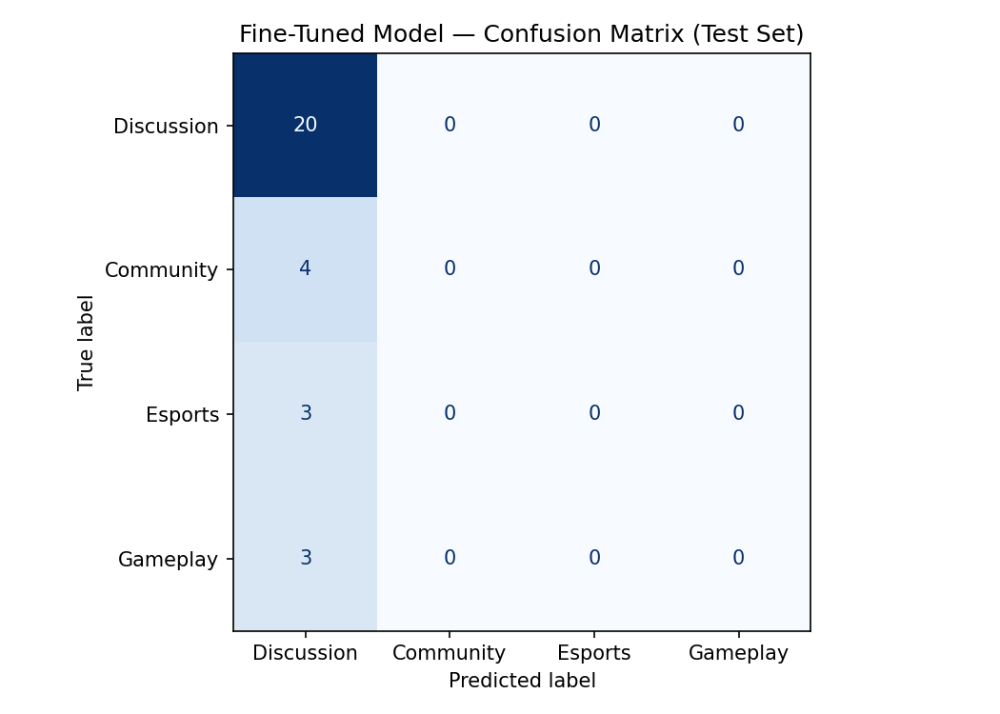

# Reddit Text Classification: Final Evaluation Report

## Dataset Link
The final manually verified dataset can be found here: [`league of legend_download.csv`](./league%20of%20legend_download.csv)

---

## 1. Community Choice and Reasoning
We selected the **r/LeagueofLegends** community. This community is unique because its public posts frequently cross boundaries between structural types — game announcements, gameplay clips, Esports news, and open discussion about the game. This creates a challenging natural language processing problem that requires a fine-tuned model to understand contextual intent rather than just matching simple keywords (e.g. the word "T1" can appear in a pro-play recap, a fan rant, or a personal highlight clip).

---

## 2. Label Taxonomy
To evaluate these posts, we established a mutually exclusive taxonomy:

### 1. Discussion
* **Definition:** Player opinions, complaints, or open-ended takes about the game, patches, or meta — without a factual announcement or how-to framing.
* **Example 1:** "*Window snapping out of place — I lost two games and received penalties because my game status stopped being displayed for no apparent reason between matches.*"
* **Example 2:** "*Why does every patch feel worse than the last one?*"

### 2. Community
* **Definition:** Factual announcements or shared news about updates, patches, skins, or Riot-side changes to the game.
* **Example 1:** "*Fan Champion: Sharua, warden of the veils*"
* **Example 2:** "*Patch 14.X notes released — here are the jungle changes.*"

### 3. Esports
* **Definition:** Posts about professional play — tournaments, rosters, results, or analysis of pro teams and players.
* **Example 1:** "*T1 and G2 to attend their 5th MSI in a row. T1 and G2 have qualified for twice as many MSIs as any other team.*"
* **Example 2:** "*Worlds finals MVP voting thread.*"

### 4. Gameplay
* **Definition:** Personal (non-pro) gameplay — clips, highlights, guides, and how-to-play walkthroughs from regular players.
* **Example 1:** "*How to play LOL (as a Brawl player)*"
* **Example 2:** "*Pentakill from behind as Yasuo — full clip in comments.*"

---

## 3. Data Collection, Labeling, & Distribution

### Data Source
We collected 200 public posts from r/LeagueofLegends using Communalytic. The raw fields used were post `title` and `text` (body), concatenated into a single input string before tokenization.

### Labeling Process
The data was labeled manually. We used an LLM to produce a first-pass pre-label for each row to speed up review, then a human annotator audited every single row against the taxonomy and edge-case rules documented in [`planning.md`](./planning.md). Disagreements with the pre-label were resolved by the human; the LLM's label was never accepted without review.

### Label Distribution
Our dataset contains a total of 200 labeled posts. The split was 85% train / 15% test (170 / 30). The held-out test set distribution is:

| Label      | Test posts | Test % |
|------------|------------|--------|
| Discussion | 20         | 66.7%  |
| Community  | 4          | 13.3%  |
| Esports    | 3          | 10.0%  |
| Gameplay   | 3          | 10.0%  |

The overall corpus is similarly skewed toward **Discussion**, which is the natural majority class on r/LeagueofLegends and the source of most of the difficulty in this task.

---

## 4. Modeling & Fine-Tuning Approach

### Baseline Model
* **Description:** GPT-4o zero-shot prompt classifier over the same held-out test set.
* **Prompt Used:**
```text
You are a Reddit post classifier for r/LeagueofLegends. Read the post title and body and
return exactly one label from this set: [Discussion, Community, Esports, Gameplay].

Definitions:
- Discussion: opinions, complaints, or open-ended takes about the game.
- Community:  factual announcements or news about patches, skins, or Riot updates.
- Esports:    professional play — tournaments, rosters, results, pro player analysis.
- Gameplay:   personal (non-pro) clips, highlights, guides, or how-to-play posts.

Respond with ONLY the single label, no explanation.

Post:
"""
{title}

{body}
"""
```

### Fine-Tuned Model
* **Base model:** `distilbert-base-uncased`
* **Training data:** 170 manually labeled posts (`title` + `body` concatenated, truncated to 512 tokens).
* **Setup:** 4-class sequence classification head, label map `{Discussion: 0, Community: 1, Esports: 2, Gameplay: 3}`. Trained for 3 epochs with the default Hugging Face `Trainer` settings (AdamW, learning rate 5e-5, batch size 8).
* **Evaluation:** held-out 30-post test set, same split as the baseline.

---

## 5. Results

Raw numbers (see [`evaluation_results.json`](./evaluation_results.json)):

| Model                     | Accuracy |
|---------------------------|----------|
| Baseline (GPT-4o zero-shot) | n/a — run did not produce a valid score (logged as `NaN`) |
| Fine-tuned DistilBERT     | **0.6667** (20 / 30) |

### Confusion Matrix (Fine-Tuned Model)


The matrix makes the failure mode obvious: **the fine-tuned model predicts `Discussion` for every single test example.** It gets all 20 Discussion posts right and all 10 non-Discussion posts wrong. The 66.7% accuracy is exactly the majority-class rate — the model has not learned to discriminate between classes, it has learned the prior.

---

## 6. Error Analysis

**What the model is actually doing:** collapsing to the majority class. Macro F1 in this state is roughly 0.20 (only the Discussion row has nonzero precision/recall), which is why we chose Macro F1 as the headline metric in `planning.md` — raw accuracy hides this failure.

**Why this happened:**
1. **Class imbalance.** With 170 training examples skewed ~2/3 to Discussion, DistilBERT's cheapest loss-minimizing strategy is to always predict Discussion.
2. **Tiny minority classes.** Community, Esports, and Gameplay each have ~20 training examples — not enough signal for a fresh classification head to separate them from the dominant class.
3. **Lexical overlap.** Esports posts mention champion and player names that also appear in Discussion vents; Gameplay how-tos use the same vocabulary as Discussion meta takes. Without more data, surface tokens alone don't separate them.

**What we'd change next:**
* Oversample (or use class-weighted loss) on Community / Esports / Gameplay during training.
* Collect another 200–400 posts targeted at the minority classes so each label has ≥50 training examples.
* Re-run the baseline so we have a real comparison number rather than `NaN`.
* Try `roberta-base` or a longer training schedule (5–8 epochs) with early stopping on macro F1.

---

## 7. Lessons Learned

* **Accuracy lied; the confusion matrix told the truth.** A 66.7% number sounded fine until we plotted predictions and saw a single column lit up.
* **Taxonomy is the easy part — the edge-case rules in `planning.md` were what actually made the labels usable.** The hard decisions log (Section 6 of `planning.md`) captures the kinds of posts where humans disagreed; those are exactly the posts the model would need more of to learn the distinction.
* **200 posts is enough to set up the problem, not enough to solve it.** A 4-way classifier on a heavy-tailed distribution needs more data per minority class than this dataset provides.
